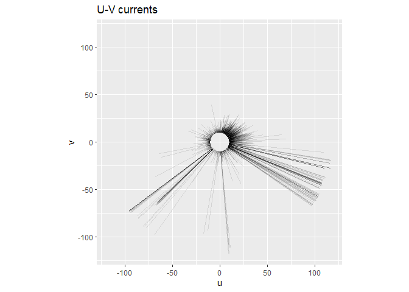
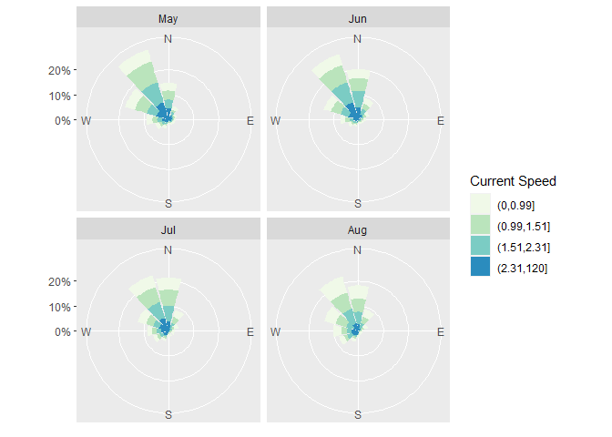

Tilto
================

## Tiltometer

This is for managing and understanding your tiltmeter data

## Requirements

-   [R v4+](https://www.r-project.org/)
-   [dplyr](https://CRAN.R-project.org/package=dplyr)
-   [readr](https://CRAN.R-project.org/package=readr)
-   [clifro](https://CRAN.R-project.org/package=clifro)
-   [stringr](https://CRAN.R-project.org/package=stringr)
-   [ggplot2](https://CRAN.R-project.org/package=ggplot2)

## Installation

    remotes::install_github("rfrancolini/tiltometer")

## Read Example Data

``` r
library(tiltometer)
x <- read_tiltometer()
x
```

    ## # A tibble: 67,146 x 5
    ##    date                speed   dir     v     u
    ##    <dttm>              <dbl> <dbl> <dbl> <dbl>
    ##  1 2021-05-03 12:00:00  92.2  226. -64.2 -66.2
    ##  2 2021-05-03 12:02:00  91.6  226. -63.5 -66.0
    ##  3 2021-05-03 12:04:00  89.4  226. -62.2 -64.3
    ##  4 2021-05-03 12:06:00  91.8  226. -63.6 -66.2
    ##  5 2021-05-03 12:08:00  89.7  226. -62.2 -64.6
    ##  6 2021-05-03 12:10:00  90.1  226. -62.6 -64.8
    ##  7 2021-05-03 12:12:00  91.6  226. -63.5 -66.1
    ##  8 2021-05-03 12:14:00  87.4  226. -61.0 -62.6
    ##  9 2021-05-03 12:16:00  92.4  226. -64.4 -66.2
    ## 10 2021-05-03 12:18:00  91.0  226. -63.6 -65.1
    ## # ... with 67,136 more rows

``` r
uv <- draw_uv(x)
uv
```

<!-- -->

``` r
month <- droplevels(factor(format(x$date, "%b"), levels = month.abb))
tiltometer_rose(x, facet = month, n_col = 2, speed.cuts = "quantile-4")
```

<!-- -->
