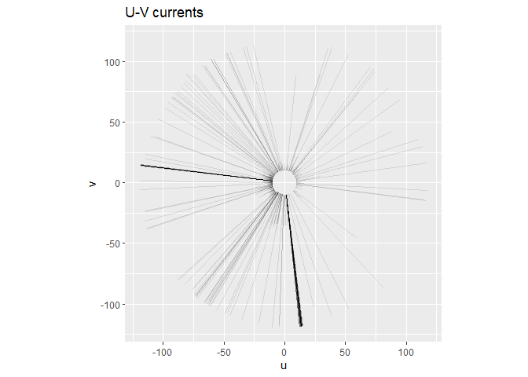

Tilto
================

## Tiltometer

This is for managing and understanding your tiltmeter data

## Requirements

-   [R v4+](https://www.r-project.org/)
-   [dplyr](https://CRAN.R-project.org/package=dplyr)
-   [readr](https://CRAN.R-project.org/package=readr)
-   [clifro](https://CRAN.R-project.org/package=clifro)
-   [stringr](https://CRAN.R-project.org/package=stringr)
-   [ggplot2](https://CRAN.R-project.org/package=ggplot2)

## Installation

    remotes::install_github("rfrancolini/tiltometer")

## Read Example Data

``` r
library(tiltometer)
x <- read_tiltometer()
x
```

    ## # A tibble: 68,598 x 5
    ##    date                speed   dir     v      u
    ##    <dttm>              <dbl> <dbl> <dbl>  <dbl>
    ##  1 2021-05-14 12:00:00  117.  39.1  90.7   73.7
    ##  2 2021-05-14 12:02:00  117.  26.3 105.    51.8
    ##  3 2021-05-14 12:04:00  117. 258.  -23.6 -114. 
    ##  4 2021-05-14 12:06:00  117.  17.8 111.    35.7
    ##  5 2021-05-14 12:08:00  117. 307.   70.8  -92.7
    ##  6 2021-05-14 12:10:00  117. 214.  -97.0  -64.9
    ##  7 2021-05-14 12:12:00  117. 225.  -83.2  -81.9
    ##  8 2021-05-14 12:14:00  116.  72.0  35.9  110. 
    ##  9 2021-05-14 12:16:00  116. 221.  -87.6  -75.7
    ## 10 2021-05-14 12:18:00  116. 221.  -87.7  -76.6
    ## # ... with 68,588 more rows

``` r
uv <- draw_uv(x)
uv
```

<!-- -->

``` r
month <- droplevels(factor(format(x$date, "%b"), levels = month.abb))
tiltometer_rose(x, facet = month, n_col = 2, speed.cuts = "quantile-4")
```

<!-- -->
